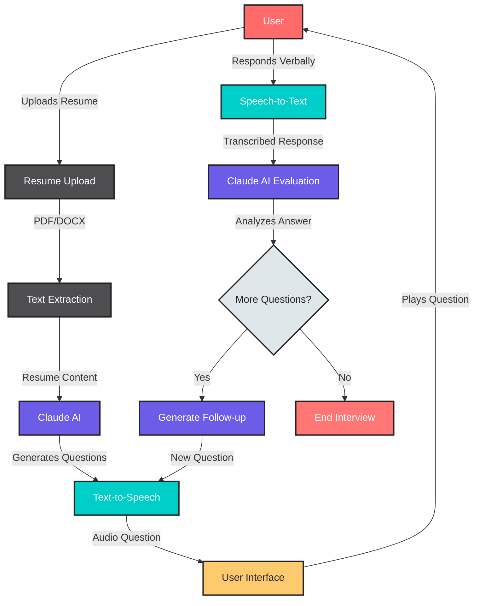

# Resumate

**Your personal AI interview coach**

## 📝 Problem Statement

Resumate addresses a critical gap in interview preparation for new graduates. Many face challenges such as:

- Lack of platforms to practice interview scenarios
- Interview anxiety and confidence issues
- Limited feedback on interview performance

ResuMate is an AI-powered interview platform designed to help new graduates master the art of interviewing. By simulating real-world interview scenarios with intelligent feedback, we empower users to build confidence, improve their communication skills, and face real interviews without fear.


## 🛠️ Tech Stack


### Frontend
- React 19
- React Router DOM
- Axios for API requests
- TailwindCSS for styling
- Lucide React for icons

### Backend
- Express.js
- Claude AI (Anthropic) for question generation
- ElevenLabs API for Text-to-Speech and Speech-to-Text
- PDF parsing capabilities (pdf-parse)
- Document processing (mammoth)

## 🔄 Workflow

### Visual Workflow


### API Routes
POST /api/resumate/upload-resume - Upload and process resume
POST /api/resumate/interview - Generate interview questions
POST /api/resumate/tts - Convert text to speech
POST /api/resumate/stt - Convert speech to text
```

## 🧩 Challenges & Solutions

### Claude API Integration
- Implementing context-aware question generation
- Maintaining conversation history for meaningful follow-ups
- Optimizing prompts for relevant question generation

### ElevenLabs Integration
- Implementing real-time Text-to-Speech for natural interview flow
- Handling Speech-to-Text accuracy for varied accents and speech patterns
- Managing API rate limits and optimizing audio processing

## 🔐 Environment Setup

### Backend (.env)
```
PORT=5000
ELEVENLABS_API_KEY=your_elevenlabs_api_key
ANTHROPIC_API_KEY=your_anthropic_api_key
```

### Frontend (.env)
```
VITE_API_URL=http://localhost:5000/api/resumate
```

## 🚀 Getting Started

### Prerequisites
- Node.js (v16 or higher)
- npm or yarn package manager

### Installation Steps

1. Clone the repository
   ```
   git clone https://github.com/yourusername/resumate.git
   cd resumate
   ```

2. Install backend dependencies
   ```
   cd backend
   npm install
   ```

3. Install frontend dependencies
   ```
   cd ../frontend
   npm install
   ```

4. Set up environment variables
   - Create .env files in both frontend and backend directories
   - Add the required environment variables as shown above

5. Start the backend server
   ```
   cd backend
   npm start
   ```

6. Start the frontend development server
   ```
   cd frontend
   npm run dev
   ```

7. Access the application at `http://localhost:5173` (or the port shown in your terminal)

## ⚠️ Prototype Limitations

This project is currently a prototype with the following limitations:

- Limited number of industry-specific question templates
- Potential delays in speech processing during peak usage
- Basic resume parsing capabilities
- Limited session duration due to API constraints
- UI optimized primarily for desktop use

## 🔮 Future Development

For future versions, we plan to:

1. Implement user accounts and session history
2. Add specialized interview modes (technical, behavioral, etc.)
3. Provide detailed performance analytics and improvement suggestions
4. Enhance mobile responsiveness

